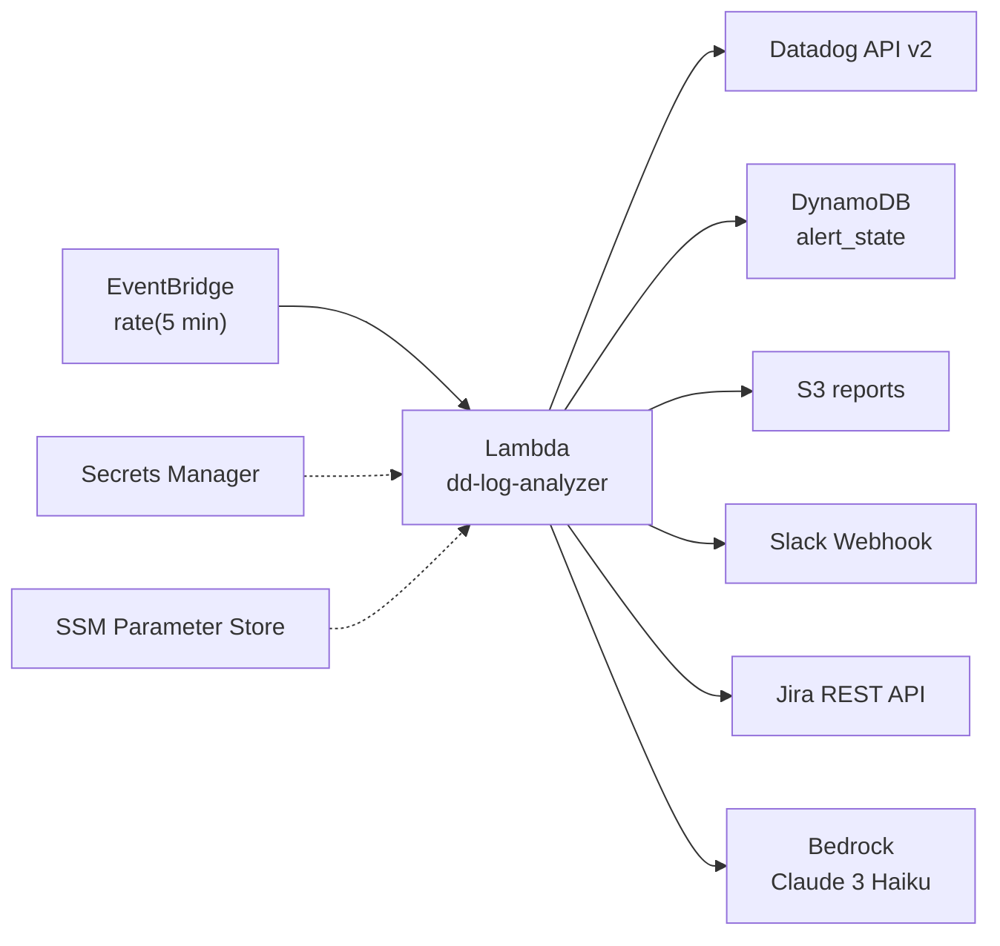
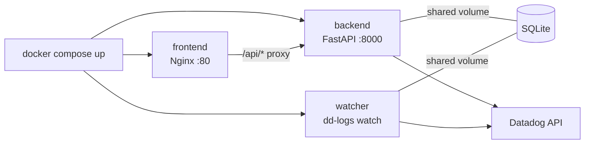
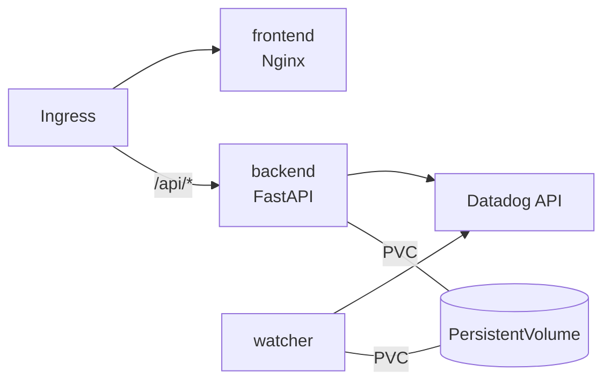

# dd-log-analyzer

A Datadog log analysis agent with **pattern detection**, **anomaly surfacing**, **error correlation**, **trend analysis**, and **AI-powered incident reports** — with Slack and Jira alerting.

Run it **locally via CLI** for ad-hoc investigation, use the **web dashboard** for a rich UI with live log viewing, or deploy it as an **AWS Lambda** for 24/7 automated monitoring. All modes share the same analysis engine and query presets.

## Features

- **Two-tier analysis** — server-side aggregation (covers ALL logs) + targeted search (sampled deep analysis)
- **Pattern detection** — tokenize, fingerprint, and cluster similar log messages
- **Anomaly detection** — Z-score volume spikes, error bursts, frequency shifts
- **Error correlation** — group errors by fingerprint, track cross-service propagation, identify root causes
- **Trend analysis** — rolling averages, linear regression, baseline comparison
- **AI anomaly interpreter** — AWS Bedrock (Claude 3 Haiku) reads actual error logs and writes DevOps-grade incident descriptions
- **Slack alerts** — Block Kit formatted messages with Datadog deep-links
- **Jira tickets** — auto-create tickets with severity-mapped priority and dedup
- **DynamoDB dedup** — cooldown-based fingerprinting prevents repeated alerts for the same anomaly
- **HTML reports** — standalone reports with Chart.js visualizations (local file or S3 with pre-signed URLs)
- **Maintenance API integration** — checks service health endpoints and correlates unhealthy services with Datadog logs
- **Query presets** — save and reuse common queries in YAML config
- **Web dashboard** — local web UI with live Datadog log viewer, anomaly history, preset management, and service detail pages with severity filtering

## Project Structure

```
datadog-log-analyzer/
├── config/default.yaml              # Presets, thresholds, scope
├── Dockerfile.backend               # FastAPI backend image
├── Dockerfile.frontend              # Vite → Nginx frontend image
├── Dockerfile.watcher               # Continuous monitoring image
├── .dockerignore                    # Docker build exclusions
├── .github/workflows/
│   └── docker-build.yml             # CI/CD: build + push to GHCR
├── deploy/
│   ├── docker/                      # Docker Compose (local)
│   │   ├── docker-compose.yml       # 3-service stack
│   │   ├── nginx.conf               # Reverse proxy config
│   │   └── .env.example             # Environment template
│   └── helm/dd-log-analyzer/        # Helm chart (EKS)
│       ├── Chart.yaml               # Chart metadata
│       ├── values.yaml              # Configurable values
│       └── templates/               # K8s manifests
├── demo/index.html                  # Interactive demo UI
├── infra/                           # Terraform (Lambda deployment)
│   ├── main.tf                      # Provider, S3 backend
│   ├── lambda.tf                    # Lambda + IAM role + Bedrock permissions
│   ├── eventbridge.tf               # 5-min schedule
│   ├── dynamodb.tf                  # Alert dedup table
│   ├── s3.tf                        # Reports bucket (prevent_destroy)
│   ├── variables.tf                 # Configurable inputs
│   └── outputs.tf                   # Resource ARNs
├── scripts/package.sh               # Lambda zip builder
├── src/dd_log_analyzer/
│   ├── cli.py                       # Click CLI (local)
│   ├── lambda_handler.py            # Lambda entry point (AWS)
│   ├── client.py                    # Datadog API v2 wrapper
│   ├── config.py                    # Local config loader (.env + YAML)
│   ├── config_aws.py                # AWS config loader (Secrets Manager + SSM)
│   ├── cache.py                     # TTL response cache
│   ├── query/engine.py              # Query builder + executor
│   ├── analysis/
│   │   ├── engine.py                # Orchestrator (two-tier)
│   │   ├── patterns.py              # Tokenization + fingerprint clustering
│   │   ├── anomalies.py             # Z-score + burst detection
│   │   ├── errors.py                # Cross-service error correlation
│   │   ├── trends.py                # Linear regression + baselines
│   │   └── ai_describer.py          # Bedrock Claude 3 Haiku integration
│   ├── notifications/
│   │   ├── slack.py                 # Slack Block Kit alerts
│   │   ├── jira.py                  # Jira REST API tickets
│   │   ├── alert_state.py           # SQLite dedup (local)
│   │   └── dynamo_alert_state.py    # DynamoDB dedup (Lambda)
│   ├── reporting/
│   │   ├── console.py               # Rich terminal output (local)
│   │   ├── html_report.py           # Chart.js HTML report
│   │   ├── json_report.py           # Structured JSON export
│   │   └── s3_report.py             # S3 upload + pre-signed URLs
│   └── webapp/
│       ├── server.py                # FastAPI backend (REST API)
│       ├── auth.py                  # JWT authentication
│       ├── db.py                    # SQLite anomaly history
│       └── run.py                   # Entry point (dd-logs-web)
├── webapp/frontend/                 # Vite + vanilla JS frontend
│   ├── index.html                   # SPA shell
│   └── src/
│       ├── main.js                  # Router + auth
│       ├── api.js                   # API client
│       ├── styles/index.css         # Dark theme design system
│       └── pages/                   # Dashboard, anomalies, logs, settings, service
└── tests/test_analysis.py           # Unit tests
```

---

## CLI Reference

### Global Options

These apply to **all** `dd-logs` commands:

```
dd-logs [OPTIONS] COMMAND [ARGS]
```

| Flag | Short | Default | Description |
|------|-------|---------|-------------|
| `--profile` | | `default` | Config profile name (loads `config/<profile>.yaml`) |
| `--verbose` | `-v` | off | Enable verbose/debug logging |

**Examples:**

```bash
dd-logs --profile staging health
dd-logs -v analyze "env:prod" --time "last 1h"
```

---

### `dd-logs health`

Verify Datadog API connectivity and configuration.

```bash
dd-logs health
```

No additional options. Returns connection status, API key validation, and configured scope.

---

### `dd-logs query`

Search and display Datadog logs in the terminal.

```
dd-logs query [QUERY] [OPTIONS]
```

| Flag | Short | Default | Description |
|------|-------|---------|-------------|
| `QUERY` | | `*` | Datadog log query string (positional argument) |
| `--time` | `-t` | `last 1h` | Time range (e.g. `last 15m`, `last 6h`, `last 24h`) |
| `--limit` | `-l` | `100` | Maximum number of logs to return |
| `--preset` | `-p` | none | Use a saved query preset from config |

**Examples:**

```bash
# All logs from the last hour (default)
dd-logs query

# Filter by service and status
dd-logs query "env:prod service:aggregatoradapter status:error"

# Short time window with limited results
dd-logs query '*' --time "last 15m" --limit 50

# Use a saved preset
dd-logs query --preset kong-errors --time "last 6h"

# Complex query with exclusions
dd-logs query '-status:(warn OR info OR debug) @msg:"failed to fetch KongPlugin"' --time "last 6h"

# Combine service + status
dd-logs query "service:konggateway status:error" -t "last 30m" -l 200

# Search across all services
dd-logs query "status:critical" --time "last 2h" --limit 500
```

---

### `dd-logs analyze`

Run full analysis on Datadog logs — pattern detection, anomaly detection, error correlation, and trend analysis.

```
dd-logs analyze [QUERY] [OPTIONS]
```

| Flag | Short | Default | Description |
|------|-------|---------|-------------|
| `QUERY` | | `*` | Datadog log query string |
| `--time` | `-t` | `last 1h` | Time range |
| `--preset` | `-p` | none | Use a saved query preset |
| `--notify-slack` | | off | Send Slack alerts for detected anomalies |
| `--create-jira` | | off | Create Jira tickets for detected anomalies |
| `--format` | `-f` | `console` | Output format: `console`, `json`, or `html` |
| `--output` | `-o` | none | Output file path (required for `json`/`html` format) |

**Examples:**

```bash
# Basic analysis — terminal output
dd-logs analyze "env:prod service:aggregatoradapter" --time "last 1h"

# Analyze all error logs from the last 30 minutes
dd-logs analyze "status:error" --time "last 30m"

# With Slack notifications
dd-logs analyze "env:prod service:konggateway" --time "last 2h" --notify-slack

# With both Slack + Jira
dd-logs analyze --preset kong-errors --notify-slack --create-jira

# Generate HTML report
dd-logs analyze "env:prod" --time "last 6h" --format html --output report.html

# Generate JSON report
dd-logs analyze "status:error" --time "last 24h" -f json -o errors.json

# Using a preset with all notifications
dd-logs analyze --preset api-5xx --time "last 1h" --notify-slack --create-jira

# Verbose mode to see tier 1/tier 2 details
dd-logs -v analyze "env:prod" --time "last 1h"

# Analyze a specific service with HTML output + Slack
dd-logs analyze "service:corecustomeragreement status:error" -t "last 3h" -f html -o ca-errors.html --notify-slack
```

---

### `dd-logs report`

Generate an analysis report file (HTML or JSON). This is a shortcut for `analyze --format <fmt> --output <path>` without notifications.

```
dd-logs report [QUERY] [OPTIONS]
```

| Flag | Short | Default | Description |
|------|-------|---------|-------------|
| `QUERY` | | `*` | Datadog log query string |
| `--time` | `-t` | `last 1h` | Time range |
| `--preset` | `-p` | none | Use a saved query preset |
| `--format` | `-f` | `html` | Output format: `json` or `html` |
| `--output` | `-o` | **required** | Output file path |

**Examples:**

```bash
# HTML report (default format)
dd-logs report "env:prod" --time "last 24h" --output daily-report.html

# JSON report
dd-logs report --preset api-5xx --format json --output errors.json

# Short-hand flags
dd-logs report "status:error" -t "last 6h" -f html -o /tmp/errors.html

# Report for a specific service
dd-logs report "service:aggregatoradapter" --time "last 12h" -o aggregator.html

# All logs report
dd-logs report '*' --time "last 1h" --output all-services.html
```

---

### `dd-logs watch`

Continuously monitor Datadog logs and service health. Runs in a loop with two phases per cycle:
1. **Phase 1** — Calls the maintenance API to check service health
2. **Phase 2** — Runs anomaly analysis (single query or all-services discovery)

```
dd-logs watch [QUERY] [OPTIONS]
```

| Flag | Short | Default | Description |
|------|-------|---------|-------------|
| `QUERY` | | `*` | Datadog log query string |
| `--interval` | `-i` | `60` | Polling interval in seconds |
| `--preset` | `-p` | none | Use a saved query preset |
| `--notify-slack / --no-slack` | | on | Send Slack alerts (enabled by default) |
| `--create-jira / --no-jira` | | on | Create Jira tickets (enabled by default) |
| `--all-services` | | off | Discover and analyze ALL active services individually |
| `--maintenance-url` | | prod URL | Custom maintenance API URL to check each cycle |

**Examples:**

```bash
# Watch all services with default 60s interval
dd-logs watch --all-services

# Watch with longer interval (5 minutes)
dd-logs watch --all-services --interval 300

# Watch a specific query
dd-logs watch "env:prod service:konggateway" --interval 120

# Using a preset
dd-logs watch --preset kong-errors --interval 60

# Disable Jira ticket creation
dd-logs watch --all-services --no-jira

# Disable both Slack and Jira (silent monitoring)
dd-logs watch "status:error" --no-slack --no-jira --interval 30

# Custom maintenance URL
dd-logs watch --all-services --maintenance-url "https://api.staging.example.com/health"

# Watch all services, long interval, no Jira
dd-logs watch --all-services -i 300 --no-jira

# Watch specific service with short poll
dd-logs watch "service:corecustomeragreement" -i 30 --notify-slack --create-jira

# Verbose watch to see all API calls
dd-logs -v watch --all-services --interval 60
```

#### Watch Output Phases

**Phase 1 — Maintenance Check:**
- If all healthy: `Phase 1: Checking maintenance API... OK`
- If unhealthy: displays nested panels showing affected services, root cause (Kong attribution), and remediation steps

**Phase 2 — Anomaly Scan:**
- Standard mode: analyzes the specified query
- `--all-services` mode: discovers all active services, analyzes each individually, shows per-service anomaly panels, and a summary table

---

## Option A: Local CLI

### 1. Install

```bash
cd datadog-log-analyzer
pip install -e .
```

### 2. Configure

```bash
cp .env.example .env
# Edit .env with your Datadog API key, App key, Slack webhook, Jira credentials
```

### 3. Verify

```bash
dd-logs health
```

---

## Option B: Web Dashboard (Local)

A local web application with a dark-themed UI for interactive log analysis, anomaly browsing, and configuration management.

### 1. Install

```bash
cd datadog-log-analyzer
pip install -e ".[web]"
cd webapp/frontend && npm install
```

### 2. Configure

```bash
cp .env.example .env
# Edit .env with your Datadog API key, App key
```

Optionally set web auth credentials (defaults: `admin` / `changeme`):

```bash
export WEB_USERNAME=admin
export WEB_PASSWORD=your-secure-password
export WEB_SECRET_KEY=your-random-secret-key
```

### 3. Run

Open **two terminals**:

```bash
# Terminal 1: Backend (FastAPI on port 8000)
dd-logs-web

# Terminal 2: Frontend (Vite dev server on port 5173)
cd webapp/frontend && npm run dev
```

Open **http://localhost:5173** and login.

### Dashboard Features

| Page | Description |
|------|-------------|
| **Dashboard** | 24h anomaly stats, service health grid, active presets, quick on-demand analysis |
| **Anomalies** | Paginated history table with service/severity/time filters |
| **Log Viewer** | Search Datadog logs with preset dropdown, time range, and limit selector |
| **Settings** | Add/edit/delete query presets, tune analysis thresholds, toggle Slack/Jira |
| **Service Detail** | Click any service name → live logs from Datadog with severity tabs (Error/Warning/Info/Debug) and auto-refresh |

> **Tip**: Run `dd-logs watch --all-services` in a separate terminal — detected anomalies are automatically saved to the dashboard's SQLite database and will appear on the Dashboard and Anomaly History pages.

---

## Option C: AWS Lambda (24/7 Automated)

Runs every 5 minutes — no laptop needed. Sends Slack alerts, creates Jira tickets, uploads HTML/JSON reports to S3, and uses AI (Bedrock Claude 3 Haiku) to generate incident descriptions from actual error logs.

### AWS Architecture



### Lambda Environment Variables

| Variable | Default | Description |
|----------|---------|-------------|
| `SECRET_NAME` | `dd-log-analyzer/secrets` | Secrets Manager secret name |
| `SSM_CONFIG_PATH` | `/dd-log-analyzer/config` | SSM parameter path for YAML config |
| `DYNAMODB_TABLE` | `dd-log-analyzer-alert-state` | DynamoDB table for dedup state |
| `S3_REPORT_BUCKET` | auto-created | S3 bucket for HTML/JSON reports |
| `AWS_REGION_NAME` | `eu-west-2` | AWS region |
| `ANALYZE_ALL_SERVICES` | `true` | Enable all-services discovery mode |
| `BEDROCK_MODEL_ID` | `anthropic.claude-3-haiku-20240307-v1:0` | Bedrock model for AI descriptions |

### Terraform Resources (`infra/`)

| File | Resources |
|------|-----------|
| `main.tf` | Provider, S3 backend |
| `lambda.tf` | Lambda (Python 3.11, 512MB, 5-min timeout) + IAM (DynamoDB, S3, SSM, Secrets Manager, Bedrock) |
| `eventbridge.tf` | Schedule rule `rate(5 minutes)` + Lambda permission |
| `dynamodb.tf` | `alert_state` table — `fingerprint` PK, TTL on `ttl_expiry`, on-demand billing |
| `s3.tf` | Reports bucket — encryption, 30-day lifecycle, `prevent_destroy`, public access blocked |
| `variables.tf` | Region, secret name, SSM path, schedule rate, memory, timeout |
| `outputs.tf` | Lambda ARN, S3 bucket, DynamoDB table, CloudWatch log group |

### 1. Store secrets

```bash
aws secretsmanager create-secret --region eu-west-2 \
  --name dd-log-analyzer/secrets \
  --secret-string '{
    "DD_API_KEY": "your-datadog-api-key",
    "DD_APP_KEY": "your-datadog-app-key",
    "SLACK_WEBHOOK_URL": "https://hooks.slack.com/services/...",
    "JIRA_BASE_URL": "https://yourcompany.atlassian.net",
    "JIRA_EMAIL": "you@company.com",
    "JIRA_API_TOKEN": "your-jira-token"
  }'
```

### 2. Store config

```bash
aws ssm put-parameter --region eu-west-2 \
  --name /dd-log-analyzer/config \
  --type String --value "$(cat config/default.yaml)"
```

### 3. Build + deploy

```bash
bash scripts/package.sh
cd infra
terraform init -backend-config="bucket=YOUR_STATE_BUCKET"
terraform plan
terraform apply
```

### 4. Tear down (keeps S3 bucket)

```bash
cd infra
terraform destroy
# S3 bucket is preserved (prevent_destroy = true)
```

### Updating queries (no redeploy needed)

Edit `config/default.yaml`, then push to SSM:

```bash
aws ssm put-parameter --region eu-west-2 \
  --name /dd-log-analyzer/config \
  --type String --value "$(cat config/default.yaml)" --overwrite
```

Changes take effect within 5 minutes.

---

## Option D: Docker Compose (Local One-Command)

Run the full web dashboard stack with a single command — no need for separate terminals.

### Docker Architecture



### 1. Clone and start

```bash
git clone https://github.com/dd-log/dd-loganalyzer
cd dd-loganalyzer/deploy/docker
cp .env.example .env
# Edit .env with your Datadog API key, App key, etc.
docker compose up -d
```

### 2. Access the dashboard

Open **http://localhost** and login (default: `admin` / `changeme`).

### 3. Configuration

Edit `deploy/docker/config/default.yaml` and restart:

```bash
docker compose restart backend watcher
```

### Watcher options (via environment variables)

| Variable | Default | Description |
|----------|---------|-------------|
| `WATCH_INTERVAL` | `60` | Polling interval in seconds |
| `WATCH_ALL_SERVICES` | `true` | Discover and analyze all services |
| `WATCH_SLACK` | `false` | Enable Slack alerts |
| `WATCH_JIRA` | `false` | Enable Jira ticket creation |

### Stop

```bash
docker compose down        # stop (preserves data)
docker compose down -v     # stop and remove data volume
```

---

## Option E: Kubernetes (EKS via Helm)

Deploy the web dashboard to an EKS cluster using the included Helm chart.

### EKS Architecture



### 1. Install

```bash
helm install dd-log-analyzer ./deploy/helm/dd-log-analyzer \
  --namespace dd-log-analyzer \
  --create-namespace \
  -f values.yaml
```

### 2. Minimal values.yaml

```yaml
secrets:
  datadogApiKey: "your-datadog-api-key"
  datadogAppKey: "your-datadog-app-key"
  datadogSite: "datadoghq.eu"
  webUsername: "admin"
  webPassword: "your-secure-password"
  webSecretKey: "your-random-secret-key"

ingress:
  enabled: true
  className: nginx
  host: dd-logs.your-domain.com
  tls:
    enabled: true
    secretName: dd-logs-tls
  annotations:
    cert-manager.io/cluster-issuer: letsencrypt-prod

watcher:
  interval: 300
  allServices: true
  slack: true
  jira: false
```

### 3. Upgrade

```bash
helm upgrade dd-log-analyzer ./deploy/helm/dd-log-analyzer \
  --namespace dd-log-analyzer \
  -f values.yaml
```

### 4. Uninstall

```bash
helm uninstall dd-log-analyzer -n dd-log-analyzer
```

### Helm Chart Components

| Resource | Description |
|----------|-------------|
| `backend-deployment` | FastAPI backend (1 replica) |
| `frontend-deployment` | Nginx serving SPA (1 replica) |
| `watcher-deployment` | Continuous Datadog monitoring (1 replica) |
| `ingress` | Routes `/api/*` → backend, `/*` → frontend |
| `pvc` | 1Gi PersistentVolume for SQLite |
| `secret` | Datadog keys, auth creds, integrations |
| `configmap` | Analysis config YAML + Nginx config |
| `serviceaccount` | For IRSA (EKS IAM roles) |

---

## Configuration

Edit `config/default.yaml` to customize:

- **Global scope** — auto-prepend `env:prod` to all queries
- **Presets** — save named queries for reuse
- **Thresholds** — anomaly Z-score (`2.5`), burst window (`120s`), burst min count (`50`), trend bucket (`5min`)
- **Alert cooldown** — dedup window in minutes (default: `15`)
- **Slack** — webhook URL, channel override
- **Jira** — project key, issue type, severity mapping, per-service assignees

## AI Anomaly Interpreter

When anomalies are detected, the Lambda sends ALL error-level log messages to **AWS Bedrock (Claude 3 Haiku)** for analysis. The AI generates:

1. **What is failing** — specific error patterns from the logs
2. **Root cause hypothesis** — based on actual error content
3. **Impact assessment** — affected services and users
4. **Investigation steps** — specific `kubectl`, Datadog, or infra checks

Cost: **~$0.0001 per anomaly** (~$0.25/M input tokens). Falls back to template descriptions if Bedrock is unavailable.

> **Note**: You need to enable Bedrock model access for Claude 3 Haiku in your AWS account. Go to the [Bedrock console](https://console.aws.amazon.com/bedrock/) → Model access → Request access.

## Architecture

```
┌─ Option A: Local CLI ────────────────────────────────┐
│  dd-logs (Click) → Query Engine → Analysis → Console │
│                         ↕              ↓             │
│                   Datadog API    Slack / Jira        │
│                                 Dedup: SQLite        │
└──────────────────────────────────────────────────────┘

┌─ Option B: Web Dashboard (dev mode) ─────────────────┐
│  Browser → Vite (JS) → FastAPI → Analysis/Datadog   │
│                            ↕              ↓          │
│                      Datadog API   SQLite (history)  │
│  Auth: JWT + HMAC-SHA256                             │
│  Config: YAML + .env                                 │
└──────────────────────────────────────────────────────┘

┌─ Option C: AWS Lambda ───────────────────────────────┐
│  EventBridge (5 min) → Lambda → Analysis → S3 Reports│
│                           ↕           ↓              │
│                     Datadog API  Slack / Jira        │
│                                  Dedup: DynamoDB     │
│  AI: Bedrock Claude 3 Haiku (error log analysis)     │
│  Config: SSM + Secrets Manager                       │
└──────────────────────────────────────────────────────┘

┌─ Option D: Docker Compose ───────────────────────────┐
│  docker compose up → backend + frontend + watcher    │
│  Nginx (:80) → FastAPI (:8000) → Datadog API         │
│  Shared SQLite volume for anomaly persistence        │
│  One command, three containers                       │
└──────────────────────────────────────────────────────┘

┌─ Option E: Kubernetes (EKS via Helm) ────────────────┐
│  helm install → Deployments + Services + Ingress     │
│  Ingress → frontend (Nginx) + backend (FastAPI)      │
│  Watcher Deployment → continuous monitoring          │
│  PVC for SQLite · IRSA for AWS access                │
│  ConfigMap (config) · Secret (credentials)           │
└──────────────────────────────────────────────────────┘
```

## Requirements

- Python 3.11+ (for CLI and dev mode)
- Docker + Docker Compose (for containerized local deployment)
- Kubernetes + Helm 3 (for EKS deployment)
- Datadog API Key + Application Key (`logs_read_data` scope)
- Slack Incoming Webhook URL (for alerts)
- Jira API Token (for ticket creation)
- AWS account with Terraform (for Lambda deployment)
- AWS Bedrock access for Claude 3 Haiku (for AI descriptions)
